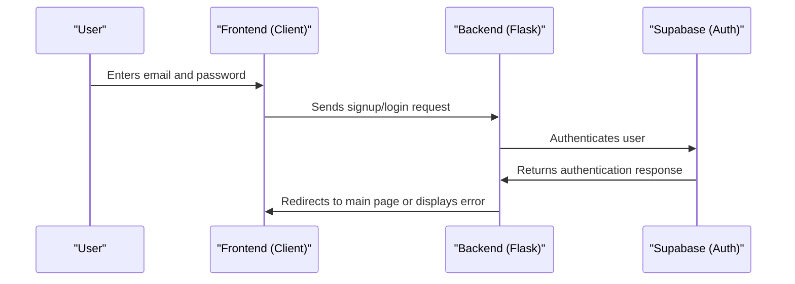

# Chapter 1: User Authentication
Welcome to the first chapter of our tutorial on building `themoodapp`! In this chapter, we'll explore the concept of User Authentication, which is like a gatekeeper that ensures only authorized users can access certain features of our application.

## What is User Authentication?
Imagine you're building a private diary app where users can store their personal thoughts and feelings. You want to make sure that only the user who wrote those thoughts can read them. That's where User Authentication comes in – it helps verify the identity of users and ensures that only they can access their own data.

## Key Concepts
Let's break down User Authentication into simple key concepts:

1. **Signup**: Creating a new account with a unique email and password.
2. **Login**: Accessing the application with the email and password you created during signup.
3. **Logout**: Ending your current session, so others can't access your account.

## How User Authentication Works in `themoodapp`
Let's walk through a simple example. Suppose a new user, Alice, wants to use `themoodapp`. She'll first need to signup by providing an email and password. Once she's signed up, she can log in to access the app's features. When she's done, she can log out to secure her account.

### Signup Process
Here's a simplified view of the signup process:
```python
@app.route('/signup', methods=['POST'])
def signup():
    # Get email and password from the request
    email = request.form.get('email')
    password = request.form.get('password')
    
    # Create a new user with Supabase
    response = supabase.auth.sign_up({
        'email': email,
        'password': password,
    })
    
    # Handle the response (e.g., check for errors)
    if 'error' in response:
        flash(response['error']['message'], 'error')
        return redirect(url_for('signup_page'))
    
    # If signup is successful, redirect to login page
    session['signup_success'] = True
    return redirect(url_for('login_page'))
```
This code snippet shows how `themoodapp` handles the signup process using Supabase for authentication.

### Login Process
Similarly, here's a simplified view of the login process:
```python
@app.route('/login', methods=['POST'])
def login():
    # Get email and password from the request
    email = request.form.get('email')
    password = request.form.get('password')
    
    # Authenticate the user with Supabase
    response = supabase.auth.sign_in_with_password({
        'email': email,
        'password': password,
    })
    
    # Store user info in the session
    session['user_email'] = email
    session['user_uuid'] = response.user.id
    
    # Redirect to the main page
    return jsonify({"success": True, "message": "Logged in successfully"}), 200
```
This code snippet demonstrates how `themoodapp` authenticates users during the login process.

## Under the Hood: How User Authentication Works
Let's dive deeper into the internal implementation. Here's a high-level overview of the authentication flow:

This sequence diagram illustrates the steps involved in authenticating a user.

## What's Next?
In this chapter, we've learned about User Authentication and how it works in `themoodapp`. We've covered the key concepts of signup, login, and logout, and explored the internal implementation.

In the next chapter, we'll dive into [Front-end Logic](02_front_end_logic.md), where we'll explore how the client-side logic is handled in `themoodapp`.

---

Generated by [AI Codebase Knowledge Builder](https://github.com/The-Pocket/Tutorial-Codebase-Knowledge)