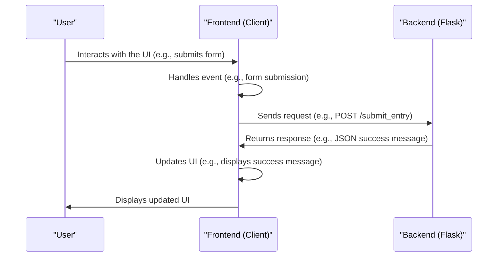

# Chapter 2: Front-end Logic
In the previous chapter, [User Authentication](01_user_authentication.md), we learned how to secure our `themoodapp` by ensuring only authorized users can access certain features. Now, let's dive into the world of Front-end Logic, which is all about handling user interactions on the client-side.

## What is Front-end Logic?
Imagine you're using `themoodapp` to track your mood. You slide a bar to rate your mood, type in a description, and click "Submit". The app responds by displaying a success message. This seamless interaction is made possible by Front-end Logic, which is like a conductor that orchestrates the user interface and reacts to user inputs.

## Key Concepts
Let's break down Front-end Logic into simple key concepts:

1. **Event Handling**: Capturing user interactions like clicks, form submissions, or keyboard input.
2. **DOM Manipulation**: Updating the user interface dynamically based on user actions or data received from the server.
3. **API Interactions**: Sending requests to the server to fetch or submit data.

## Handling User Interactions
Let's explore how `themoodapp` handles user interactions. For example, when a user submits their mood data, the app prevents the default form submission behavior and instead sends an AJAX request to the server.

```javascript
dataForm.addEventListener('submit', async function(event) {
    event.preventDefault(); // Prevent native form submission
    // ...
});
```
This code snippet shows how `themoodapp` captures the form submission event and prevents the default behavior.

## Updating the User Interface
When the user submits their mood data, the app updates the UI to display a success message. This is achieved through DOM manipulation.

```javascript
document.getElementById('responseMessage').textContent = result.message;
```
This code updates the text content of an HTML element with the response message from the server.

## Interacting with the Server
`themoodapp` uses API interactions to send requests to the server. For example, when the user submits their mood data, the app sends a POST request to the `/submit_entry` endpoint.

```javascript
const response = await fetch('/submit_entry', {
    method: 'POST',
    headers: { 'Content-Type': 'application/json' },
    body: JSON.stringify({ mood, description, timezone })
});
```
This code snippet demonstrates how `themoodapp` sends a POST request to the server with the user's mood data.

## Under the Hood: How Front-end Logic Works
Let's dive deeper into the internal implementation. Here's a high-level overview of the front-end logic flow:

This sequence diagram illustrates the steps involved in handling user interactions and updating the UI.

## Code Walkthrough
Let's explore the code that makes this happen. In `static/js/scripts.js`, we have event listeners that capture user interactions and send requests to the server.

```javascript
// Handle mood form submission
const dataForm = document.getElementById('dataForm');
if (dataForm) {
    dataForm.addEventListener('submit', async function(event) {
        // ...
    });
}
```
This code snippet shows how `themoodapp` handles the mood form submission event.

## What's Next?
In this chapter, we've learned about Front-end Logic and how it handles user interactions in `themoodapp`. We've explored key concepts like event handling, DOM manipulation, and API interactions.

In the next chapter, we'll dive into [Routing and URL Handling](03_routing_and_url_handling.md), where we'll explore how `themoodapp` manages client-side routing and URL handling.

---

Generated by [AI Codebase Knowledge Builder](https://github.com/The-Pocket/Tutorial-Codebase-Knowledge)