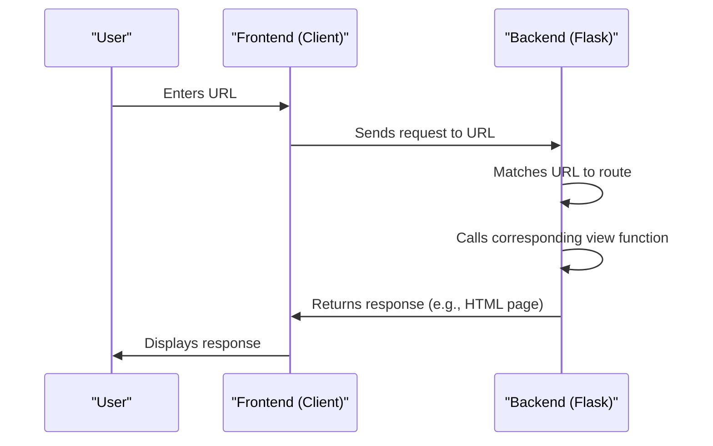

# Chapter 3: Routing and URL Handling
In the previous chapter, [Front-end Logic](02_front_end_logic.md), we explored how `themoodapp` handles user interactions on the client-side. Now, let's dive into the world of Routing and URL Handling, which is all about managing client-side routing and URL handling in `themoodapp`.

## What is Routing and URL Handling?
Imagine you're using `themoodapp` and you want to access your dashboard. You type in the URL, and the app takes you to the right page. This is made possible by Routing and URL Handling, which is like a navigator that directs users to the right pages.

## Key Concepts
Let's break down Routing and URL Handling into simple key concepts:

1. **Route Definition**: Mapping URLs to specific application endpoints.
2. **URL Parameters**: Capturing values from the URL to use in the application.
3. **Redirects**: Sending users from one URL to another.

## Defining Routes
In `themoodapp`, routes are defined using the `@app.route()` decorator. For example, the route for the login page is defined as:
```python
@app.route('/login_page', methods=['GET'])
def login_page():
    # Render the login page
    return render_template('login.html')
```
This code snippet shows how `themoodapp` defines a route for the login page.

## Handling URL Parameters
`themoodapp` uses URL parameters to capture values from the URL. For example, the `user_uuid` is captured from the session:
```python
user_uuid = session.get('user_uuid')
```
This code snippet demonstrates how `themoodapp` captures the `user_uuid` from the session.

## Redirecting Users
`themoodapp` uses redirects to send users from one URL to another. For example, when a user logs out, they are redirected to the login page:
```python
@app.route('/logout')
def logout():
    # Remove user data from the session
    session.pop('user_email', None)
    return redirect(url_for('login_page'))  # Redirect to login page
```
This code snippet shows how `themoodapp` redirects users to the login page after logging out.

## Under the Hood: How Routing and URL Handling Works
Let's dive deeper into the internal implementation. Here's a high-level overview of the routing flow:

This sequence diagram illustrates the steps involved in handling a URL request.

## Code Walkthrough
Let's explore the code that makes this happen. In `moodtrack.py`, we have route definitions that map URLs to specific application endpoints:
```python
# Route for the existing main page (index.html)
@app.route('/')
@login_required
def index():
    # Render the index page
    return render_template('index.html', last_week=last_monday_str, last_day=last_day_str)
```
This code snippet shows how `themoodapp` defines a route for the main page.

## What's Next?
In this chapter, we've learned about Routing and URL Handling and how it manages client-side routing and URL handling in `themoodapp`. We've explored key concepts like route definition, URL parameters, and redirects.

In the next chapter, we'll dive into [Mood Data Management](04_mood_data_management.md), where we'll explore how `themoodapp` manages mood data.

---

Generated by [AI Codebase Knowledge Builder](https://github.com/The-Pocket/Tutorial-Codebase-Knowledge)