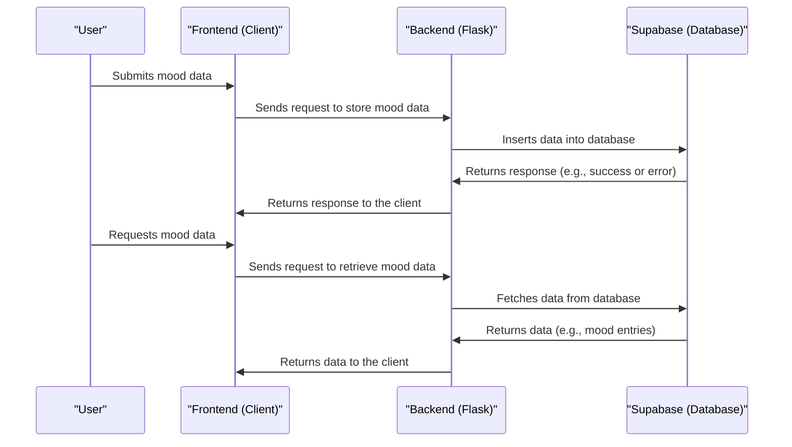

# Chapter 4: Mood Data Management
In the previous chapter, [Routing and URL Handling](03_routing_and_url_handling.md), we explored how `themoodapp` manages client-side routing and URL handling. Now, let's dive into the world of Mood Data Management, which is all about storing and retrieving user mood data.

## What is Mood Data Management?
Imagine you're using `themoodapp` to track your mood. You submit your mood data, and the app stores it securely. Later, you can access your past mood data to see how you've been feeling over time. This is made possible by Mood Data Management, which is like a digital diary that stores and organizes your mood entries.

## Key Concepts
Let's break down Mood Data Management into simple key concepts:

1. **Data Storage**: Storing user mood data securely in a database.
2. **Data Retrieval**: Fetching stored mood data for a specific user.

## Storing Mood Data
When a user submits their mood data, `themoodapp` stores it in a Supabase database. Here's a simplified view of how it works:
```python
def insert_data_to_supabase(data):
    # Prepare data for insertion
    data_to_insert = {
        "date": current_time,
        "mood": data['mood'],
        "description": data['description'],
        "timezone": data['timezone'],
        "user_uuid": data['user_uuid']
    }
    # Insert into Supabase
    response = requests.post(url, headers=headers, data=json.dumps(data_to_insert))
    # ...
```
This code snippet shows how `themoodapp` prepares and inserts mood data into Supabase.

## Retrieving Mood Data
To retrieve mood data, `themoodapp` uses the `load_data` function, which fetches data from Supabase and returns a Pandas DataFrame.
```python
@cache.cached(timeout=10800, key_prefix=lambda: f'supabase_data_cache_{g.user_uuid}')
def load_data(supabase, SUPABASE_DB):
    # Fetch data from Supabase
    response = supabase.table(f'{SUPABASE_DB}').select('id, date, mood, description','timezone').eq('user_uuid', g.user_uuid).execute()
    data = response.data
    df = pd.DataFrame(data)
    # ...
```
This code snippet demonstrates how `themoodapp` retrieves mood data from Supabase and caches it for performance.

## Under the Hood: How Mood Data Management Works
Let's dive deeper into the internal implementation. Here's a high-level overview of the data storage and retrieval flow:

This sequence diagram illustrates the steps involved in storing and retrieving mood data.

## Code Walkthrough
Let's explore the code that makes this happen. In `utils/supabase_utils.py`, we have the `insert_data_to_supabase` function that stores mood data in Supabase.
```python
# Prepare data for insertion
data_to_insert = {
    "date": current_time,
    "mood": data['mood'],
    "description": data['description'],
    "timezone": data['timezone'],
    "user_uuid": data['user_uuid']
}
```
This code snippet shows how `themoodapp` prepares the data for insertion into Supabase.

## What's Next?
In this chapter, we've learned about Mood Data Management and how it stores and retrieves user mood data in `themoodapp`. We've explored key concepts like data storage and retrieval.

In the next chapter, we'll dive into [Dashboard Generation](05_dashboard_generation.md), where we'll explore how `themoodapp` generates dashboards using the stored mood data.

---

Generated by [AI Codebase Knowledge Builder](https://github.com/The-Pocket/Tutorial-Codebase-Knowledge)