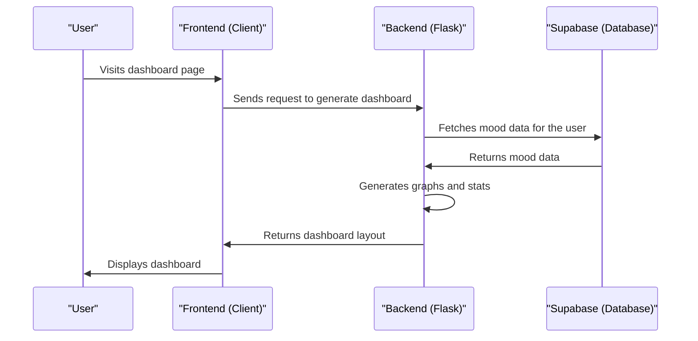

# Chapter 5: Dashboard Generation
In the previous chapter, [Mood Data Management](04_mood_data_management.md), we explored how `themoodapp` stores and retrieves user mood data. Now, let's dive into the world of Dashboard Generation, which is all about creating a visual representation of the user's mood data.

## What is Dashboard Generation?
Imagine you're using `themoodapp` to track your mood over time. You want to see how your mood has been changing, so you can identify patterns and trends. That's where Dashboard Generation comes in – it's like a visualizer that turns your mood data into insightful charts and stats.

## Key Concepts
Let's break down Dashboard Generation into simple key concepts:

1. **Data Loading**: Fetching the user's mood data from the database.
2. **Graph Generation**: Creating visual representations of the mood data, such as charts and plots.
3. **Summary Statistics**: Calculating summary statistics, like average mood and number of entries.

## How Dashboard Generation Works
When a user visits the dashboard page, `themoodapp` generates a dashboard layout with various graphs and stats. Here's a simplified view of how it works:
```python
def generate_dashboard_layout():
    # Load the data for graph generation
    df = load_data(sb, SUPABASE_DB)
    # Generate cached graphs
    summary_stats, fig_monthly_moods, fig_weekly_moods, fig_day_moods, fig_time_moods = generate_all_graphs(df)
    # Return the updated layout with the latest figures
    return html.Div(children=[
        html.H1(children='Mood Tracking Dashboard'),
        summary_stats,
        dcc.Graph(id='monthly-moods', figure=fig_monthly_moods),
        dcc.Graph(id='weekly-moods', figure=fig_weekly_moods),
        dcc.Graph(id='day-of-week-moods', figure=fig_day_moods),
        dcc.Graph(id='time-of-day-moods', figure=fig_time_moods),
    ])
```
This code snippet shows how `themoodapp` generates the dashboard layout with various graphs and stats.

## Data Loading
`themoodapp` uses the `load_data` function to fetch the user's mood data from Supabase. Here's a simplified view of how it works:
```python
@cache.cached(timeout=10800, key_prefix=lambda: f'supabase_data_cache_{g.user_uuid}')
def load_data(supabase, SUPABASE_DB):
    # Fetch data from Supabase
    response = supabase.table(f'{SUPABASE_DB}').select('id, date, mood, description','timezone').eq('user_uuid', g.user_uuid).execute()
    data = response.data
    df = pd.DataFrame(data)
    # ...
```
This code snippet demonstrates how `themoodapp` fetches the user's mood data from Supabase and caches it for performance.

## Graph Generation
`themoodapp` uses various graph generation functions, like `generate_monthly_mood_plot` and `generate_weekly_mood_plot`, to create visual representations of the mood data. Here's a simplified view of how it works:
```python
def generate_monthly_mood_plot(df):
    # Calculate monthly average mood
    df['Month Start'] = df['date'].dt.to_period('M').dt.to_timestamp()
    monthly_mood_avg = df.groupby('Month Start')['mood'].mean().reset_index()
    # Create the bar plot for monthly average mood
    fig_monthly_moods = px.bar(monthly_mood_avg, x='Month Start', y='mood', title='Average Mood by Month Start Date')
    # ...
```
This code snippet shows how `themoodapp` generates a monthly mood plot using the user's mood data.

## Under the Hood: How Dashboard Generation Works
Let's dive deeper into the internal implementation. Here's a high-level overview of the dashboard generation flow:

This sequence diagram illustrates the steps involved in generating the dashboard.

## Code Walkthrough
Let's explore the code that makes this happen. In `graphs.py`, we have the `generate_dashboard_layout` function that generates the dashboard layout.
```python
def generate_dashboard_layout():
    # ...
    return html.Div(children=[
        # ...
    ])
```
This code snippet shows how `themoodapp` generates the dashboard layout.

## What's Next?
In this chapter, we've learned about Dashboard Generation and how it creates a visual representation

---

Generated by [AI Codebase Knowledge Builder](https://github.com/The-Pocket/Tutorial-Codebase-Knowledge)