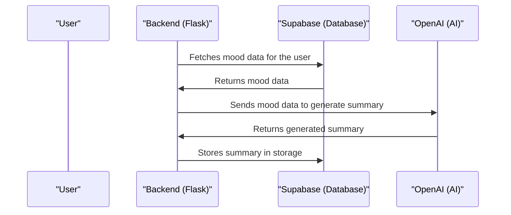

# Chapter 6: Automated Summaries
In the previous chapter, [Dashboard Generation](05_dashboard_generation.md), we explored how `themoodapp` generates dashboards using the stored mood data. Now, let's dive into the world of Automated Summaries, which is all about generating daily and weekly summaries based on user mood data.

## What is Automated Summaries?
Imagine you're using `themoodapp` to track your mood over time. You want to get a summary of how you've been feeling daily or weekly, so you can reflect on your progress. That's where Automated Summaries comes in – it's like a personal assistant that summarizes your mood trends.

## Key Concepts
Let's break down Automated Summaries into simple key concepts:

1. **Data Collection**: Gathering the user's mood data for the desired period (daily or weekly).
2. **Summary Generation**: Using the collected data to generate a summary, often with the help of AI.
3. **Storage and Retrieval**: Storing the generated summaries for later access.

## How Automated Summaries Works
When `themoodapp` generates automated summaries, it follows a simple process:

1. It collects the user's mood data for the desired period (daily or weekly) using the `mood_data` function.
2. It uses the collected data to generate a summary using the `mood_summary` function, which leverages OpenAI's capabilities.
3. The generated summary is then stored in Supabase storage for later access.

Here's a simplified view of how the `mood_summary` function works:
```python
def mood_summary(user_uuid, period):
    # Fetch mood logs and analysis historical data
    df = mood_data(period, user_uuid)
    df_md = fetch_mood_analysis_historical(user_uuid, period=period)
    # ...
    # Call the OpenAI API to generate the summary
    response = openai_client.chat.completions.create(
        model='gpt-4o-mini',  
        messages=messages,
        max_tokens=4095,
        temperature=0.4,
        top_p=1,
        frequency_penalty=0,
        presence_penalty=0.2
    )
    # ...
```
This code snippet shows how `themoodapp` uses OpenAI to generate a summary based on the user's mood data.

## Under the Hood: How Automated Summaries Works
Let's dive deeper into the internal implementation. Here's a high-level overview of the automated summaries flow:

This sequence diagram illustrates the steps involved in generating automated summaries.

## Code Walkthrough
Let's explore the code that makes this happen. In `utils/automations.py`, we have the `run_mood_summary` function that orchestrates the automated summaries process:
```python
def run_mood_summary(period):
    # Get list of all unique user UUIDs
    user_uuids = get_all_user_uuids()  
    # ...
    for user_uuid in user_uuids:
        if period == 'weekly':
            # Check if it's Monday and between 12:00 AM and 12:21 AM 
            if day_of_week == 0 and current_datetime.time() >= pd.Timestamp('00:00:00').time() and current_datetime.time() <= pd.Timestamp('01:21:00').time():
                # Step 1: Summarize the weekly mood data using OpenAI
                mood_summary_text = mood_summary(user_uuid, 'weekly')
                # ...
```
This code snippet shows how `themoodapp` generates weekly summaries using OpenAI.

## What's Next?
In this chapter, we've learned about Automated Summaries and how it generates daily and weekly summaries based on user mood data in `themoodapp`. We've explored key concepts like data collection, summary generation, and storage.

In the next chapter, we'll dive into [OpenAI Integration](07_openai_integration.md), where we'll explore how `themoodapp` leverages OpenAI's capabilities to generate insightful summaries and analysis.

---

Generated by [AI Codebase Knowledge Builder](https://github.com/The-Pocket/Tutorial-Codebase-Knowledge)