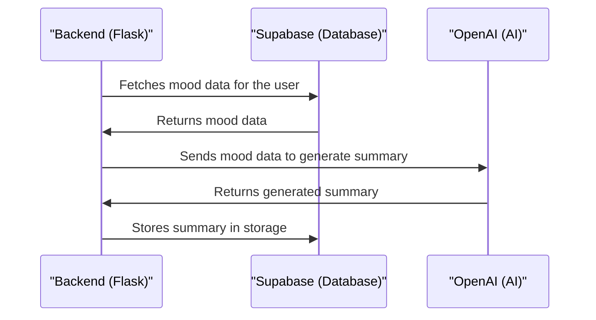

# Chapter 7: OpenAI Integration
In the previous chapter, [Automated Summaries](06_automated_summaries.md), we explored how `themoodapp` generates daily and weekly summaries based on user mood data. Now, let's dive into the world of OpenAI Integration, which is all about leveraging OpenAI's capabilities to analyze and summarize user mood data.

## What is OpenAI Integration?
Imagine you're using `themoodapp` to track your mood over time. You want to get insights into your mood patterns, so you can understand what's affecting your mood. That's where OpenAI Integration comes in – it's like a smart analyst that provides insights into your mood trends.

## Key Concepts
Let's break down OpenAI Integration into simple key concepts:

1. **API Interaction**: Sending requests to OpenAI's API to analyze user mood data.
2. **Prompt Engineering**: Crafting the right prompts to guide OpenAI's analysis.
3. **Response Processing**: Handling the response from OpenAI and extracting useful insights.

## How OpenAI Integration Works
When `themoodapp` uses OpenAI Integration, it follows a simple process:

1. It collects the user's mood data using the `mood_data` function.
2. It crafts a prompt using the collected data and sends it to OpenAI's API using the `mood_summary` function.
3. OpenAI's API analyzes the data and returns a summary, which is then processed and stored in Supabase storage.

Here's a simplified view of how the `mood_summary` function works:
```python
def mood_summary(user_uuid, period):
    # Fetch mood logs and analysis historical data
    df = mood_data(period, user_uuid)
    # ...
    # Call the OpenAI API to generate the summary
    response = openai_client.chat.completions.create(
        model='gpt-4o-mini',  
        messages=messages,
        max_tokens=4095,
        temperature=0.4,
        top_p=1,
        frequency_penalty=0,
        presence_penalty=0.2
    )
    # ...
```
This code snippet shows how `themoodapp` uses OpenAI to generate a summary based on the user's mood data.

## Under the Hood: How OpenAI Integration Works
Let's dive deeper into the internal implementation. Here's a high-level overview of the OpenAI Integration flow:

This sequence diagram illustrates the steps involved in generating a summary using OpenAI.

## Code Walkthrough
Let's explore the code that makes this happen. In `utils/openai_utils.py`, we have the `mood_summary` function that generates a summary using OpenAI:
```python
@traceable
def mood_summary(user_uuid, period):
    # Fetch mood logs and analysis historical data
    df = mood_data(period, user_uuid)
    # ...
```
This code snippet shows how `themoodapp` fetches the user's mood data and uses it to generate a summary.

## What's Next?
In this chapter, we've learned about OpenAI Integration and how it leverages OpenAI's capabilities to analyze and summarize user mood data in `themoodapp`. We've explored key concepts like API interaction, prompt engineering, and response processing.

In the next chapter, we'll dive into [Supabase Storage](08_supabase_storage.md), where we'll explore how `themoodapp` uses Supabase to store and manage user data.

---

Generated by [AI Codebase Knowledge Builder](https://github.com/The-Pocket/Tutorial-Codebase-Knowledge)