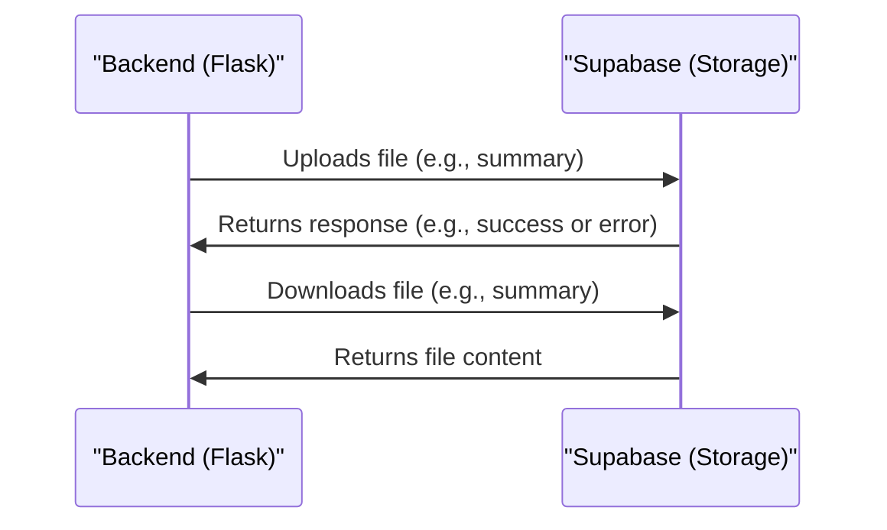

# Chapter 8: Supabase Storage
In the previous chapter, [OpenAI Integration](07_openai_integration.md), we explored how `themoodapp` leverages OpenAI's capabilities to analyze and summarize user mood data. Now, let's dive into the world of Supabase Storage, which is all about handling file storage and retrieval for user summaries.

## What is Supabase Storage?
Imagine you're using `themoodapp` to track your mood over time, and you've generated a weekly summary. You want to access this summary later, so you need a reliable way to store and retrieve it. That's where Supabase Storage comes in – it's like a cloud storage service that keeps your summaries safe.

## Key Concepts
Let's break down Supabase Storage into simple key concepts:

1. **File Upload**: Storing files, like summaries, in Supabase Storage.
2. **File Download**: Retrieving stored files, like summaries, from Supabase Storage.

## How Supabase Storage Works
When `themoodapp` uses Supabase Storage, it follows a simple process:

1. It uploads files, like summaries, to Supabase Storage using the `upload_mood_summary_to_supabase` function.
2. It downloads stored files, like summaries, from Supabase Storage using the `download_summary_from_supabase` function.

Here's a simplified view of how the `upload_mood_summary_to_supabase` function works:
```python
def upload_mood_summary_to_supabase(fname, user_uuid):
    s3 = boto3.client('s3', region_name=S3_REGION, endpoint_url=S3_ENDPOINT, aws_access_key_id=ACCESS_KEY_ID, aws_secret_access_key=SECRET_ACCESS_KEY)
    bucket_name = S3_BUCKET
    object_name = f'{user_uuid}/{fname}'
    with open(fname, 'rb') as file_data:
        s3.upload_fileobj(file_data, bucket_name, object_name)
    print(f"File {fname} uploaded successfully to {bucket_name}/{object_name}")
```
This code snippet shows how `themoodapp` uploads a file to Supabase Storage.

## Under the Hood: How Supabase Storage Works
Let's dive deeper into the internal implementation. Here's a high-level overview of the Supabase Storage flow:

This sequence diagram illustrates the steps involved in storing and retrieving files using Supabase Storage.

## Code Walkthrough
Let's explore the code that makes this happen. In `utils/supabase_storage_utils.py`, we have the `download_summary_from_supabase` function that downloads a summary from Supabase Storage:
```python
def download_summary_from_supabase(period, user_uuid, user_timezone):
    # ...
    response = supabase.storage.from_(S3_BUCKET).download(filename)
    if response:
        return response.decode('utf-8')
    else:
        print("No content found in the file.")
        return None
```
This code snippet shows how `themoodapp` downloads a summary from Supabase Storage.

## What's Next?
In this chapter, we've learned about Supabase Storage and how it handles file storage and retrieval for user summaries in `themoodapp`. We've explored key concepts like file upload and download.

In the next chapter, we'll dive into [Caching Mechanism](09_caching_mechanism.md), where we'll explore how `themoodapp` uses caching to improve performance.

---

Generated by [AI Codebase Knowledge Builder](https://github.com/The-Pocket/Tutorial-Codebase-Knowledge)