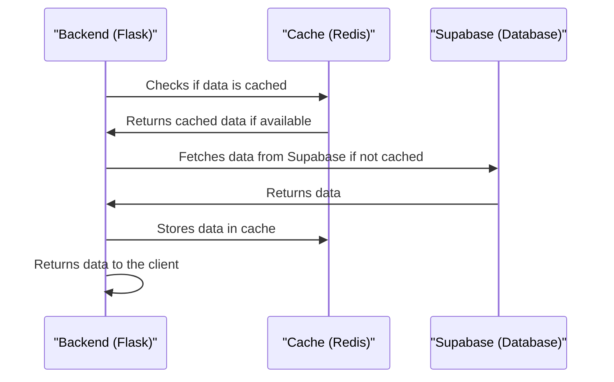

# Chapter 9: Caching Mechanism
In the previous chapter, [Supabase Storage](08_supabase_storage.md), we explored how `themoodapp` uses Supabase to store and manage user data. Now, let's dive into the world of Caching Mechanism, which is all about improving application performance by storing frequently accessed data.

## What is Caching Mechanism?
Imagine you're using `themoodapp` to track your mood over time. You visit the dashboard page multiple times a day, and each time, the app generates the same graphs and stats. This can be slow and inefficient. That's where Caching Mechanism comes in – it's like a fast memory that stores frequently accessed data, so the app can retrieve it quickly instead of regenerating it every time.

## Key Concepts
Let's break down Caching Mechanism into simple key concepts:

1. **Cache Storage**: Storing data in a cache, like Redis, to improve performance.
2. **Cache Retrieval**: Fetching stored data from the cache to avoid regenerating it.
3. **Cache Invalidation**: Updating or removing cached data when it becomes outdated.

## How Caching Mechanism Works
When `themoodapp` uses Caching Mechanism, it follows a simple process:

1. It checks if the required data is already cached.
2. If cached, it retrieves the data from the cache.
3. If not cached, it generates the data, stores it in the cache, and returns it.

Here's a simplified view of how the `load_data` function works with caching:
```python
@cache.cached(timeout=10800, key_prefix=lambda: f'supabase_data_cache_{g.user_uuid}')
def load_data(supabase, SUPABASE_DB):
    # Fetch data from Supabase
    response = supabase.table(f'{SUPABASE_DB}').select('id, date, mood, description','timezone').eq('user_uuid', g.user_uuid).execute()
    data = response.data
    df = pd.DataFrame(data)
    # ...
```
This code snippet shows how `themoodapp` caches the `load_data` function to improve performance.

## Under the Hood: How Caching Mechanism Works
Let's dive deeper into the internal implementation. Here's a high-level overview of the caching flow:

This sequence diagram illustrates the steps involved in caching data.

## Code Walkthrough
Let's explore the code that makes this happen. In `graphs.py`, we have the `init_cache` function that initializes the cache:
```python
def init_cache(app):
    """Initialize Redis cache for the given Flask app."""
    app.config['CACHE_TYPE'] = 'RedisCache'
    app.config['CACHE_REDIS_URL'] = os.getenv('REDISCLOUD_URL')
    cache.init_app(app)
```
This code snippet shows how `themoodapp` initializes the Redis cache.

## What's Next?
In this chapter, we've learned about Caching Mechanism and how it improves application performance in `themoodapp`. We've explored key concepts like cache storage, retrieval, and invalidation.

In the next chapter, we'll dive into [Dependency Management](10_dependency_management.md), where we'll explore how `themoodapp` manages its dependencies.

---

Generated by [AI Codebase Knowledge Builder](https://github.com/The-Pocket/Tutorial-Codebase-Knowledge)