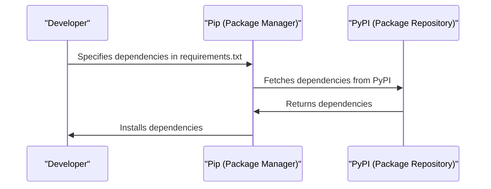

# Chapter 10: Dependency Management
In the previous chapter, [Caching Mechanism](09_caching_mechanism.md), we explored how `themoodapp` uses caching to improve performance. Now, let's dive into the world of Dependency Management, which is all about managing the project's dependencies and requirements.

## What is Dependency Management?
Imagine you're building a complex application like `themoodapp`. You need various libraries and tools to make it work, such as Flask for the backend, Dash for the frontend, and Supabase for the database. Managing these dependencies can be challenging, especially when you need to ensure that they're compatible with each other. That's where Dependency Management comes in – it's like a librarian that keeps track of the project's dependencies.

## Key Concepts
Let's break down Dependency Management into simple key concepts:

1. **Dependency Declaration**: Specifying the dependencies required by the project.
2. **Dependency Installation**: Installing the declared dependencies.
3. **Dependency Management Tools**: Using tools like `pip` and `requirements.txt` to manage dependencies.

## How Dependency Management Works
When you manage dependencies in `themoodapp`, you follow a simple process:

1. You declare the dependencies required by the project in `requirements.txt`.
2. You use `pip` to install the declared dependencies.

Here's an example of how `requirements.txt` looks:
```
Flask==2.2.2
Flask-Caching==2.3.0
redis==5.1.1
gunicorn==20.1.0
requests==2.25.1
python-dotenv==1.0.0
boto3==1.28.12
supabase==2.7.4
openai==1.58.1
pytz==2023.3
Werkzeug==2.2.2
pandas==2.2.2
markdown==3.7
```
This code snippet shows how `themoodapp` declares its dependencies.

## Installing Dependencies
To install the dependencies, you can use `pip`:
```bash
pip install -r requirements.txt
```
This command installs all the dependencies declared in `requirements.txt`.

## Under the Hood: How Dependency Management Works
Let's dive deeper into the internal implementation. Here's a high-level overview of the dependency management flow:

This sequence diagram illustrates the steps involved in managing dependencies.

## Code Walkthrough
Let's explore the code that makes this happen. In `requirements.txt`, we have the declared dependencies:
```
# ...
Flask==2.2.2
# ...
```
This code snippet shows how `themoodapp` declares its dependencies.

## What's Next?
In this chapter, we've learned about Dependency Management and how it manages the project's dependencies and requirements in `themoodapp`. We've explored key concepts like dependency declaration, installation, and management tools.

Congratulations! You've completed the tutorial on building `themoodapp`. You've learned about various concepts, from User Authentication to Dependency Management. You can now build your own applications using these concepts. Happy coding!

---

Generated by [AI Codebase Knowledge Builder](https://github.com/The-Pocket/Tutorial-Codebase-Knowledge)