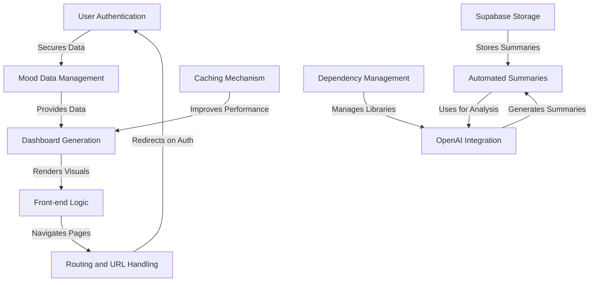

# Tutorial: themoodapp

The **Mood Tracking Application** is designed to help users track and analyze their mood patterns over time. 
It allows users to *log their daily moods*, *view summaries*, and *gain insights* through automated analysis and visualizations.
The application leverages **OpenAI for advanced mood analysis** and utilizes **Supabase for data storage and management**.

**Source Repository:** [https://github.com/emigolaso/themoodapp](https://github.com/emigolaso/themoodapp)

## Chapters

1. [User Authentication](01_user_authentication.md)
2. [Front-end Logic](02_front_end_logic.md)
3. [Routing and URL Handling](03_routing_and_url_handling.md)
4. [Mood Data Management](04_mood_data_management.md)
5. [Dashboard Generation](05_dashboard_generation.md)
6. [Automated Summaries](06_automated_summaries.md)
7. [OpenAI Integration](07_openai_integration.md)
8. [Supabase Storage](08_supabase_storage.md)
9. [Caching Mechanism](09_caching_mechanism.md)
10. [Dependency Management](10_dependency_management.md)

---

Generated by [AI Codebase Knowledge Builder](https://github.com/The-Pocket/Tutorial-Codebase-Knowledge)